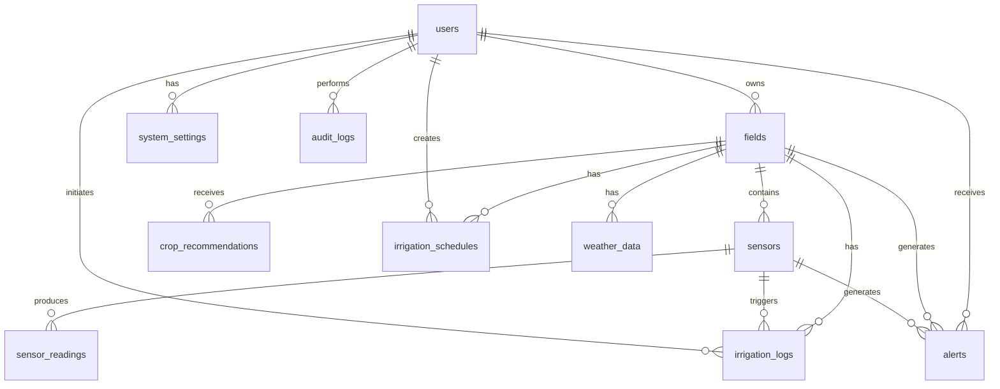

# Smart Agriculture Database Documentation

## 📋 Overview

This database schema is designed for the **Smart AI-Powered Agriculture System**, an IoT and AI-based solution for Pakistani farmers. The schema supports real-time sensor data collection, automated irrigation, crop recommendations, and farmer notifications.

## 🗄️ Database Structure

### Core Tables (11 tables)

#### 1. **users**
Stores farmer and admin account information.

**Key Fields:**
- `user_id` - Primary key
- `email`, `phone` - Unique login credentials
- `password_hash` - Bcrypt hashed password
- `role` - farmer, admin, or technician
- `is_active`, `email_verified`, `phone_verified` - Account status flags

**Indexes:**
- `idx_email`, `idx_phone`, `idx_role`

---

#### 2. **fields**
Represents individual land plots owned by farmers.

**Key Fields:**
- `field_id` - Primary key
- `user_id` - Foreign key to users
- `location_latitude`, `location_longitude` - GPS coordinates
- `area_size`, `area_unit` - Field dimensions
- `soil_type` - Clay, Sandy, Loamy, etc.
- `current_crop`, `planting_date`, `expected_harvest_date` - Crop tracking

**Relationships:**
- One user can have multiple fields (1:N)

**Indexes:**
- `idx_user_id`, `idx_is_active`

---

#### 3. **sensors**
IoT sensor devices installed in fields.

**Key Fields:**
- `sensor_id` - Primary key
- `field_id` - Foreign key to fields
- `sensor_type` - soil_moisture, temperature, humidity, light, rain, water_flow, combined
- `device_id` - ESP32 MAC address (unique identifier)
- `sensor_model` - e.g., YL-69, DHT22, FC-37
- `battery_level`, `firmware_version` - Device health tracking

**Relationships:**
- One field can have multiple sensors (1:N)

**Indexes:**
- `idx_field_id`, `idx_device_id`, `idx_sensor_type`, `idx_is_active`

---

#### 4. **sensor_readings**
Real-time data collected from IoT sensors.

**Key Fields:**
- `reading_id` - Primary key (BIGINT for high volume)
- `sensor_id` - Foreign key to sensors
- `soil_moisture`, `temperature`, `humidity` - Environmental metrics
- `light_intensity`, `rainfall`, `water_flow_rate` - Additional metrics
- `battery_voltage`, `signal_strength` - Device health
- `reading_timestamp` - When the reading was taken

**Relationships:**
- One sensor generates many readings (1:N)

**Indexes:**
- `idx_sensor_id`, `idx_reading_timestamp`, `idx_sensor_timestamp` (composite)

**Performance Note:**
This table will grow rapidly. Consider partitioning by date or archiving old data after 6-12 months.

---

#### 5. **irrigation_logs**
Records all irrigation events (automatic, manual, scheduled).

**Key Fields:**
- `log_id` - Primary key (BIGINT)
- `field_id` - Foreign key to fields
- `sensor_id` - Foreign key to sensors (NULL for manual)
- `irrigation_type` - automatic, manual, scheduled
- `start_time`, `end_time`, `duration_minutes` - Timing
- `water_used_liters` - Water consumption tracking
- `soil_moisture_before`, `soil_moisture_after` - Effectiveness tracking
- `initiated_by` - User ID if manual

**Relationships:**
- Links to fields, sensors, and users

**Indexes:**
- `idx_field_id`, `idx_start_time`, `idx_irrigation_type`

---

#### 6. **crop_recommendations**
AI-generated crop suggestions based on soil and weather data.

**Key Fields:**
- `recommendation_id` - Primary key
- `field_id` - Foreign key to fields
- `recommended_crop` - Crop name
- `confidence_score` - AI model confidence (0-100)
- `soil_moisture_avg`, `temperature_avg`, `humidity_avg` - Input data
- `expected_yield` - Predicted yield in kg/acre
- `water_requirement` - Low, Medium, High
- `growth_duration_days` - Days to harvest
- `recommendation_reason` - AI explanation
- `model_version` - ML model version used
- `is_accepted` - Whether farmer accepted the recommendation

**Relationships:**
- One field can have multiple recommendations (1:N)

**Indexes:**
- `idx_field_id`, `idx_recommended_crop`, `idx_created_at`

---

#### 7. **alerts**
Notifications and warnings sent to farmers.

**Key Fields:**
- `alert_id` - Primary key (BIGINT)
- `user_id`, `field_id`, `sensor_id` - Context references
- `alert_type` - critical, warning, info, success
- `alert_category` - soil_moisture, temperature, irrigation, sensor_offline, etc.
- `title`, `message` - Alert content
- `threshold_value`, `current_value` - What triggered the alert
- `is_read`, `is_resolved` - Status tracking
- `push_notification_sent`, `email_sent`, `sms_sent` - Delivery tracking

**Relationships:**
- Links to users, fields, and sensors

**Indexes:**
- `idx_user_id`, `idx_field_id`, `idx_alert_type`, `idx_is_read`, `idx_created_at`

---

#### 8. **irrigation_schedules**
Predefined irrigation plans for fields.

**Key Fields:**
- `schedule_id` - Primary key
- `field_id` - Foreign key to fields
- `schedule_name` - Descriptive name
- `start_date`, `end_date` - Schedule validity period
- `time_of_day` - Preferred irrigation time
- `duration_minutes` - How long to irrigate
- `frequency` - daily, alternate_days, weekly, custom
- `custom_days` - e.g., "Mon,Wed,Fri"
- `is_active` - Enable/disable schedule

**Relationships:**
- One field can have multiple schedules (1:N)

**Indexes:**
- `idx_field_id`, `idx_is_active`

---

#### 9. **weather_data**
Weather forecast and historical weather information.

**Key Fields:**
- `weather_id` - Primary key (BIGINT)
- `field_id` - Foreign key to fields
- `temperature`, `humidity`, `rainfall`, `wind_speed`, `cloud_cover` - Weather metrics
- `weather_condition` - Sunny, Rainy, Cloudy, etc.
- `forecast_date` - Date of weather data
- `is_forecast` - TRUE for forecast, FALSE for actual
- `data_source` - e.g., OpenWeatherMap, Local Sensor

**Relationships:**
- One field has many weather records (1:N)

**Indexes:**
- `idx_field_id`, `idx_forecast_date`, `idx_is_forecast`

---

#### 10. **system_settings**
Configuration settings (global and user-specific).

**Key Fields:**
- `setting_id` - Primary key
- `user_id` - NULL for global settings
- `setting_key` - Setting name
- `setting_value` - Setting value (TEXT for flexibility)
- `setting_type` - global, user, field
- `description` - What the setting does

**Example Settings:**
- `soil_moisture_threshold_low`: 30
- `auto_irrigation_enabled`: true
- `notification_email`: true

**Indexes:**
- `idx_setting_key`
- Unique constraint on `(user_id, setting_key)`

---

#### 11. **audit_logs**
Security and activity tracking.

**Key Fields:**
- `log_id` - Primary key (BIGINT)
- `user_id` - Who performed the action
- `action_type` - LOGIN, LOGOUT, CREATE, UPDATE, DELETE
- `table_name`, `record_id` - What was affected
- `old_value`, `new_value` - Changes (JSON format)
- `ip_address`, `user_agent` - Request metadata

**Indexes:**
- `idx_user_id`, `idx_action_type`, `idx_created_at`

---

## 🔗 Entity Relationships



## 📊 Database Normalization

The schema follows **Third Normal Form (3NF)**:

✅ **1NF:** All tables have atomic values and primary keys  
✅ **2NF:** No partial dependencies (all non-key attributes depend on the entire primary key)  
✅ **3NF:** No transitive dependencies (non-key attributes don't depend on other non-key attributes)

### Design Decisions:

1. **Separate sensor_readings table** - Prevents bloating the sensors table with millions of rows
2. **irrigation_logs separate from sensor_readings** - Different access patterns and retention policies
3. **weather_data separate from sensor_readings** - Weather data may come from external APIs
4. **system_settings** - Flexible key-value store for configuration without schema changes

## 🚀 Installation & Setup

### Step 1: Create Database

```bash
mysql -u root -p < schema.sql
```

### Step 2: Load Sample Data (Optional)

```bash
mysql -u root -p < sample_data.sql
```

### Step 3: Create Database User

```sql
CREATE USER 'smart_agri_user'@'localhost' IDENTIFIED BY 'your_secure_password';
GRANT ALL PRIVILEGES ON smart_agriculture.* TO 'smart_agri_user'@'localhost';
FLUSH PRIVILEGES;
```

### Step 4: Verify Installation

```sql
USE smart_agriculture;
SHOW TABLES;
SELECT COUNT(*) FROM users;
```

## 🔍 Common Queries

### Get Latest Sensor Readings for a Field

```sql
SELECT 
    s.sensor_type,
    s.device_id,
    sr.soil_moisture,
    sr.temperature,
    sr.humidity,
    sr.reading_timestamp
FROM sensors s
JOIN sensor_readings sr ON s.sensor_id = sr.sensor_id
WHERE s.field_id = 1
    AND sr.reading_timestamp >= DATE_SUB(NOW(), INTERVAL 24 HOUR)
ORDER BY sr.reading_timestamp DESC;
```

### Get Unread Critical Alerts for a User

```sql
SELECT 
    a.title,
    a.message,
    a.alert_type,
    f.field_name,
    a.created_at
FROM alerts a
JOIN fields f ON a.field_id = f.field_id
WHERE a.user_id = 1
    AND a.is_read = FALSE
    AND a.alert_type = 'critical'
ORDER BY a.created_at DESC;
```

### Calculate Total Water Usage by Field

```sql
SELECT 
    f.field_name,
    COUNT(il.log_id) as irrigation_count,
    SUM(il.water_used_liters) as total_water_liters,
    AVG(il.duration_minutes) as avg_duration_minutes
FROM fields f
LEFT JOIN irrigation_logs il ON f.field_id = il.field_id
WHERE il.start_time >= DATE_SUB(NOW(), INTERVAL 30 DAY)
GROUP BY f.field_id, f.field_name;
```

### Get AI Crop Recommendations with Highest Confidence

```sql
SELECT 
    f.field_name,
    cr.recommended_crop,
    cr.confidence_score,
    cr.expected_yield,
    cr.water_requirement,
    cr.growth_duration_days
FROM crop_recommendations cr
JOIN fields f ON cr.field_id = f.field_id
WHERE cr.confidence_score >= 85
ORDER BY cr.confidence_score DESC;
```

## ⚡ Performance Optimization

### Recommended Indexes (Already Included)

All critical indexes are already defined in `schema.sql`:
- Foreign key indexes for JOIN operations
- Timestamp indexes for date-range queries
- Composite indexes for common query patterns

### Data Archival Strategy

**sensor_readings** table will grow rapidly:

```sql
-- Archive readings older than 6 months
CREATE TABLE sensor_readings_archive LIKE sensor_readings;

INSERT INTO sensor_readings_archive
SELECT * FROM sensor_readings
WHERE reading_timestamp < DATE_SUB(NOW(), INTERVAL 6 MONTH);

DELETE FROM sensor_readings
WHERE reading_timestamp < DATE_SUB(NOW(), INTERVAL 6 MONTH);
```

### Table Partitioning (For High Volume)

```sql
-- Partition sensor_readings by month
ALTER TABLE sensor_readings
PARTITION BY RANGE (YEAR(reading_timestamp) * 100 + MONTH(reading_timestamp)) (
    PARTITION p202411 VALUES LESS THAN (202412),
    PARTITION p202412 VALUES LESS THAN (202501),
    PARTITION p202501 VALUES LESS THAN (202502),
    PARTITION p_future VALUES LESS THAN MAXVALUE
);
```

## 🔒 Security Best Practices

1. **Password Hashing:** Use bcrypt with salt rounds ≥ 10
2. **SQL Injection Prevention:** Always use parameterized queries
3. **Least Privilege:** Application user should not have DROP/ALTER permissions
4. **Audit Logging:** All sensitive operations are logged in `audit_logs`
5. **Data Encryption:** Consider encrypting sensitive fields (email, phone) at application level

## 📈 Scalability Considerations

### Current Design Supports:
- ✅ 10,000+ farmers
- ✅ 50,000+ fields
- ✅ 100,000+ sensors
- ✅ 100M+ sensor readings (with archival)

### Future Enhancements:
- **Read Replicas:** For analytics and reporting
- **Caching Layer:** Redis for frequently accessed data
- **Time-Series Database:** InfluxDB for sensor readings
- **Sharding:** Partition data by region/province

## 🛠️ Maintenance Tasks

### Daily
```sql
-- Check for offline sensors
SELECT s.device_id, s.sensor_type, MAX(sr.reading_timestamp) as last_reading
FROM sensors s
LEFT JOIN sensor_readings sr ON s.sensor_id = sr.sensor_id
WHERE s.is_active = TRUE
GROUP BY s.sensor_id
HAVING last_reading < DATE_SUB(NOW(), INTERVAL 2 HOUR);
```

### Weekly
```sql
-- Analyze table statistics
ANALYZE TABLE sensor_readings, irrigation_logs, alerts;

-- Optimize tables
OPTIMIZE TABLE sensor_readings;
```

### Monthly
```sql
-- Archive old data
-- Clean up resolved alerts older than 90 days
DELETE FROM alerts 
WHERE is_resolved = TRUE 
    AND resolved_at < DATE_SUB(NOW(), INTERVAL 90 DAY);
```

## 📞 Support

For database-related issues or questions, contact the development team.

---

**Version:** 1.0  
**Last Updated:** 2025-11-06  
**Database Engine:** MySQL 8.0+  
**Character Set:** utf8mb4 (supports Urdu and emoji)
