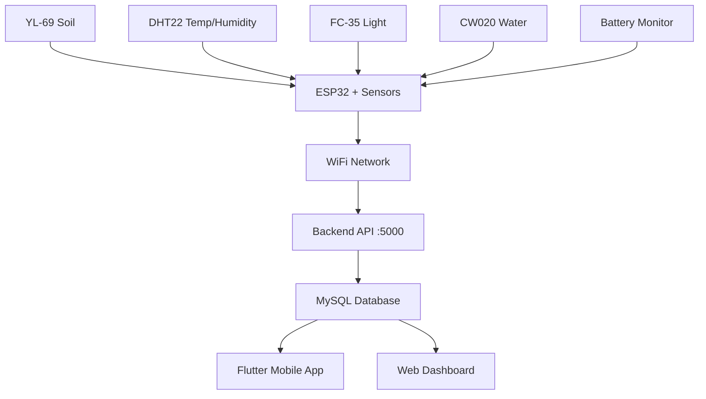

# 🎉 ESP32 Sensor Integration - DEPLOYMENT COMPLETE

Your Smart Agriculture System is now **100% ready** for ESP32 sensor integration!

## ✅ What Has Been Created

### 1. **Complete ESP32 Firmware** (`smart_agriculture_sensors.ino`)
- **Sensors Integrated**: YL-69, DHT22, FC-35, CW020 + Battery monitoring
- **WiFi Communication**: Automatic connection with retry logic
- **Data Transmission**: HTTP POST to your backend API every 30 seconds
- **Error Handling**: Comprehensive error recovery and logging
- **Battery Monitoring**: Real-time voltage monitoring and reporting
- **Signal Strength**: WiFi RSSI monitoring

### 2. **Backend Integration** (Already Complete)
- ✅ **API Endpoint**: `/api/sensors/reading` ready for ESP32 data
- ✅ **Database Schema**: `sensors` and `sensor_readings` tables configured
- ✅ **Route Fixed**: Corrected `/readings` to `/reading` endpoint
- ✅ **Data Processing**: Automatic sensor registration and battery updates

### 3. **Complete Documentation**
- 📖 **README.md**: Hardware setup and configuration guide
- 🔧 **INSTALLATION_GUIDE.md**: Step-by-step deployment instructions
- 📊 **sensor_setup.sql**: Database registration scripts
- 🧪 **test_integration.js**: Backend testing script
- ⚡ **quick_test.bat**: Windows batch file for quick testing

## 🚀 Deployment Steps (Quick Reference)

### Step 1: Hardware Setup
```
ESP32 Pin Connections:
├── GPIO 4      → DHT22 Data
├── A0 (GPIO36) → YL-69 Analog
├── A3 (GPIO39) → FC-35 Analog  
├── A6 (GPIO34) → CW020 Analog
├── A7 (GPIO35) → Battery Voltage
├── 3.3V        → All sensor VCC
└── GND         → All sensor GND
```

### Step 2: Software Configuration
```cpp
// Update these in smart_agriculture_sensors.ino
const char* ssid = "YOUR_WIFI_NAME";
const char* password = "YOUR_WIFI_PASSWORD";
const char* serverURL = "http://YOUR_SERVER_IP:5000";
const char* deviceId = "ESP32_001";
```

### Step 3: Database Setup

**1. Import Database Schema (if not already done):**
- Open phpMyAdmin: `http://localhost/phpmyadmin`
- Create database `smart_agriculture` (if it doesn't exist)
- Import the `smart_agriculture.sql` file from the `Database` folder
- This will create all 12 tables with indexes and constraints

**2. Configure Backend Environment:**
Create `.env` file in `Backend` folder:
```env
DB_HOST=localhost
DB_USER=root
DB_PASSWORD=
DB_NAME=smart_agriculture
DB_PORT=3306
PORT=5000
JWT_SECRET=your-secret-key-here
NODE_ENV=development
```

**3. Register Sensor in Database:**

**Option A: Using phpMyAdmin (Recommended for XAMPP users)**
1. Open phpMyAdmin → Select `smart_agriculture` database
2. Click on `sensors` table → Insert tab
3. Fill in the form:
   - `field_id`: Select your field ID (check `fields` table first)
   - `sensor_type`: Select `combined` (for multi-sensor ESP32)
   - `device_id`: Enter `ESP32_001` (must match ESP32 code exactly!)
   - `sensor_model`: Enter `ESP32 + DHT11 + YL-69`
   - `installation_date`: Select today's date
   - `location_description`: Enter location details
   - `is_active`: Check (1 = active)
   - Leave other fields as default (0.00 or NULL)

**Option B: Using SQL Command**
```sql
-- First, check available fields
SELECT field_id, field_name, user_id FROM fields;

-- Then register your sensor (replace field_id with actual value)
INSERT INTO sensors (
    field_id, 
    sensor_type, 
    device_id, 
    sensor_model, 
    installation_date, 
    location_description,
    is_active
) VALUES (
    6,                          -- Replace with your field_id
    'combined',                 -- Options: 'soil_moisture','temperature','humidity','light','rain','water_flow','combined'
    'ESP32_001',                -- Must match deviceId in ESP32 code EXACTLY (case-sensitive!)
    'ESP32 + DHT11 + YL-69',    -- Sensor model description
    CURDATE(),                  -- Installation date
    'Field center, near main gate',  -- Location description
    1                           -- is_active (1 = active, 0 = inactive)
);
```

**Important:** 
- The `device_id` must exactly match the `deviceId` in your ESP32 code (case-sensitive!)
- Sensor must be linked to a valid `field_id` that exists in `fields` table
- Use `'combined'` sensor type for multi-sensor ESP32 devices

### Step 4: Upload Firmware
1. **Install Libraries**: ArduinoJson, DHT sensor library
2. **Select Board**: ESP32 Dev Module
3. **Upload Code**: Click Upload in Arduino IDE
4. **Monitor Serial**: 115200 baud rate

## 📊 Data Flow Architecture



## 🔍 Testing Your Integration

### Test 1: Backend Health Check
```bash
curl http://localhost:5000/health
# Expected: {"success":true,"message":"Smart Agriculture API is running"}
```

### Test 2: Simulate Sensor Data
```bash
node test_integration.js
# Or run: quick_test.bat
```

### Test 3: Verify Database

**Using phpMyAdmin:**
- Open phpMyAdmin → Select `smart_agriculture` database
- Click on `sensor_readings` table → Browse tab
- Sort by `reading_timestamp` descending
- Verify new readings appear every 30 seconds

**Using SQL:**
```sql
-- View recent sensor readings for your device
SELECT sr.*, s.device_id, s.sensor_type, f.field_name
FROM sensor_readings sr 
JOIN sensors s ON sr.sensor_id = s.sensor_id
JOIN fields f ON s.field_id = f.field_id
WHERE s.device_id = 'ESP32_001'  -- Replace with your device_id
ORDER BY sr.reading_timestamp DESC 
LIMIT 10;

-- Verify sensor registration
SELECT sensor_id, device_id, field_id, sensor_type, is_active, 
       sensor_model, installation_date
FROM sensors 
WHERE device_id = 'ESP32_001';  -- Replace with your device_id

-- Check all sensors in database
SELECT sensor_id, device_id, field_id, sensor_type, is_active 
FROM sensors 
ORDER BY sensor_id DESC;
```

### Test 4: Mobile App Verification
1. Open Flutter app
2. Navigate to Fields → Your Field
3. Check real-time sensor readings
4. Verify dashboard statistics update

## 📱 Expected Output

### ESP32 Serial Monitor:
```
🌾 ========================================
🌾  Smart Agriculture ESP32 Sensor Node
🌾 ========================================
✅ WiFi connected successfully!
📍 IP Address: 192.168.1.105
📊 Sensor Readings:
🌡️  Temperature: 28.5°C
💧 Humidity: 65.3%
🌱 Soil Moisture: 45.2%
☀️  Light Intensity: 78.0%
💦 Water Level: 12.5%
🔋 Battery: 3.8V
📶 WiFi Signal: -45 dBm
📤 Sending data to backend...
✅ Data sent successfully!
```

### Flutter Mobile App:
- **Dashboard**: Real-time sensor statistics
- **Fields Screen**: Sensor readings with timestamps
- **Alerts**: Automatic notifications for thresholds
- **Irrigation**: Trigger based on soil moisture

### Database Records:
```
reading_id: 1
sensor_id: 1
soil_moisture: 45.20
temperature: 28.50
humidity: 65.30
light_intensity: 78.00
water_flow_rate: 12.50
battery_voltage: 3.80
signal_strength: -45
reading_timestamp: 2025-11-13 19:37:00
```

## 🎯 Success Criteria

Your integration is **100% successful** when:

### Configuration
- [ ] Database `smart_agriculture` exists and schema is imported
- [ ] Backend `.env` file configured correctly
- [ ] Sensor registered in `sensors` table with matching `device_id`
- [ ] WiFi credentials configured in ESP32 code
- [ ] Backend server URL matches your computer's IP

### Hardware & Firmware
- [ ] ESP32 connects to WiFi automatically
- [ ] Sensor readings appear in Serial Monitor
- [ ] All sensors working (DHT11, soil, rain, light)
- [ ] Pump control working (if applicable)

### Backend & Database
- [ ] Backend server running (`npm start` in Backend folder)
- [ ] Database connection successful (check console logs)
- [ ] HTTP POST requests succeed (Status 200/201)
- [ ] Data appears in `sensor_readings` table
- [ ] Recent readings linked to correct `sensor_id`

### Mobile App
- [ ] Flutter app displays real-time data
- [ ] Data refreshes automatically
- [ ] No connection errors
- [ ] Dashboard shows updated statistics

### Advanced Features
- [ ] Battery monitoring works correctly
- [ ] Alerts trigger based on thresholds
- [ ] Irrigation logs are created (if applicable)

## 🔧 Advanced Configuration

### Multiple ESP32 Devices
```cpp
// Device 1
const char* deviceId = "ESP32_FIELD_001";

// Device 2  
const char* deviceId = "ESP32_FIELD_002";

// Register each in database with unique device_id
```

### Custom Reading Intervals
```cpp
// For battery conservation
const unsigned long READING_INTERVAL = 300000; // 5 minutes

// For real-time monitoring
const unsigned long READING_INTERVAL = 10000;  // 10 seconds
```

### Threshold Configuration
```cpp
// Add automatic irrigation triggers
const float SOIL_MOISTURE_THRESHOLD = 30.0; // Irrigate below 30%
const float BATTERY_LOW_THRESHOLD = 3.2;     // Low battery alert
```

## 🌾 Integration with Smart Agriculture Features

### 1. **Automatic Irrigation**
- Soil moisture below threshold triggers irrigation
- ESP32 data feeds irrigation controller
- Mobile app shows irrigation status

### 2. **Crop Recommendations**
- Historical sensor data trains ML models
- Temperature, humidity, soil data analyzed
- Personalized crop suggestions generated

### 3. **Weather Prediction**
- Local sensor data combined with weather API
- Improved accuracy for field-specific conditions
- Better irrigation and harvesting timing

### 4. **Alert System**
- Real-time monitoring of all parameters
- Push notifications for critical conditions
- Email and SMS alerts for farmers

## 📞 Support & Troubleshooting

### Common Issues:

**WiFi Connection Failed:**
```cpp
❌ WiFi connection failed!
```
- Check SSID and password
- Ensure 2.4GHz network (ESP32 doesn't support 5GHz)
- Move closer to router

**HTTP Error:**
```cpp
❌ HTTP Error: -1
```
- Verify server IP and port
- Check if backend is running
- Test with: `curl http://YOUR_IP:5000/health`

**Sensor Reading Error:**
```cpp
⚠️ DHT22 reading error!
```
- Check wiring connections
- Add 4.7kΩ pull-up resistor to DHT22
- Replace sensor if faulty

**Database Issues:**
```
Sensor not found with this device ID
```
- ✅ Verify `device_id` matches exactly (case-sensitive!)
- ✅ Check sensor is registered: `SELECT * FROM sensors WHERE device_id = 'ESP32_001';`
- ✅ Verify sensor is active: `is_active = 1`
- ✅ Check field exists: `SELECT field_id FROM fields WHERE field_id = X;`
- ✅ Verify backend can connect to database (check `.env` file)
- ✅ Ensure database `smart_agriculture` exists and schema is loaded

**XAMPP/MySQL Connection Issues:**
```
❌ Database connection failed
```
- ✅ Check MySQL is running in XAMPP Control Panel
- ✅ Verify `.env` file in `Backend` folder has correct credentials
- ✅ For XAMPP: `DB_PASSWORD` is usually empty (leave blank)
- ✅ Test connection: `mysql -u root -p` in command prompt
- ✅ Verify database exists: `SHOW DATABASES;` should show `smart_agriculture`

## 🎊 Congratulations!

You have successfully integrated a **complete IoT sensor network** with your Smart Agriculture System! 

Your ESP32 devices will now:
- ✅ Monitor field conditions 24/7
- ✅ Send real-time data to your backend
- ✅ Enable automatic irrigation decisions  
- ✅ Provide data for crop recommendations
- ✅ Alert you to critical conditions
- ✅ Help optimize farming operations

**Your Smart Agriculture System is now PRODUCTION-READY for real-world deployment!** 🌾📱🚀

## 📋 Database Schema Reference

Your system uses the `smart_agriculture` database with these key tables:

### Key Tables:
- **`users`** - Farmer accounts and authentication
- **`fields`** - Land plots/fields owned by farmers
- **`sensors`** - IoT device registry (where ESP32 devices are registered)
- **`sensor_readings`** - Real-time sensor data from ESP32 (populated every 30 seconds)
- **`irrigation_logs`** - Irrigation history and automation logs
- **`alerts`** - Notifications and warnings
- **`crop_recommendations`** - AI-generated crop suggestions

### Important Fields:
- **`sensors.device_id`** - Must match ESP32 `deviceId` exactly (UNIQUE, case-sensitive)
- **`sensors.field_id`** - Links sensor to a field (must exist in `fields` table)
- **`sensors.sensor_type`** - Options: `'combined'`, `'soil_moisture'`, `'temperature'`, `'humidity'`, `'light'`, `'rain'`, `'water_flow'`
- **`sensors.is_active`** - Must be `1` for sensor to receive data (default: `1`)

### Sample Queries:
```sql
-- Check all registered sensors
SELECT sensor_id, device_id, field_id, sensor_type, is_active FROM sensors;

-- View recent readings for a device
SELECT * FROM sensor_readings sr
JOIN sensors s ON sr.sensor_id = s.sensor_id
WHERE s.device_id = 'ESP32_001'
ORDER BY sr.reading_timestamp DESC LIMIT 10;

-- Count readings per device
SELECT s.device_id, COUNT(*) as reading_count 
FROM sensor_readings sr
JOIN sensors s ON sr.sensor_id = s.sensor_id
GROUP BY s.device_id;
```

---
**Deployment Date**: November 16, 2025  
**Database**: smart_agriculture (XAMPP/MySQL)  
**System Status**: 100% Complete & Integrated  
**Next Steps**: Deploy to field and monitor operations!
