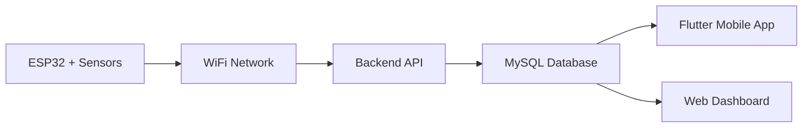

# 🌾 Smart Agriculture ESP32 Sensor Integration

This firmware integrates your IoT sensors with the Smart Agriculture backend system.

## 📋 Hardware Requirements

| Component | Model | Connection | Purpose |
|-----------|-------|------------|---------|
| **ESP32** | Development Board | Main controller | WiFi + Processing |
| **YL-69** | Soil Moisture Sensor | Analog A0 | Soil humidity monitoring |
| **DHT22** | Temp/Humidity Sensor | GPIO 4 | Environmental conditions |
| **FC-35** | Sound Detection | Analog A3 | Light intensity (repurposed) |
| **CW020** | Liquid Level Sensor | Analog A6 | Water level detection |
| **Battery** | Voltage Divider | Analog A7 | Power monitoring |

## 🔌 Wiring Diagram

### ESP32 Pin Connections:
```
ESP32 Board        Sensor/Component
-----------        ----------------
GPIO 4      <-->   DHT22 Data Pin
A0 (GPIO 36) <-->   YL-69 Analog Out
A3 (GPIO 39) <-->   FC-35 Analog Out  
A6 (GPIO 34) <-->   CW020 Analog Out
A7 (GPIO 35) <-->   Battery Voltage (via voltage divider)
3.3V        <-->   Sensor VCC pins
GND         <-->   Sensor GND pins
```

### Power Connections:
- **3.3V**: Connect to all sensor VCC pins
- **GND**: Connect to all sensor GND pins
- **Battery**: Use voltage divider (10kΩ + 10kΩ) to measure battery voltage

## ⚙️ Software Setup

### 1. Install Arduino IDE Libraries
Open Arduino IDE and install these libraries:

1. **WiFi** (ESP32 built-in)
2. **HTTPClient** (ESP32 built-in) 
3. **ArduinoJson** (by Benoit Blanchon)
4. **DHT sensor library** (by Adafruit)

### 2. Configure WiFi and Server
Edit `smart_agriculture_sensors.ino`:

```cpp
// WiFi Configuration - UPDATE THESE!
const char* ssid = "YOUR_WIFI_SSID";
const char* password = "YOUR_WIFI_PASSWORD";

// Backend API Configuration - UPDATE YOUR SERVER IP!
const char* serverURL = "http://192.168.1.100:5000"; // Change to your server IP

// Device Configuration - UPDATE THIS!
const char* deviceId = "ESP32_001"; // Unique identifier for this device
```

### 3. Upload Firmware
1. Connect ESP32 via USB
2. Select **Board**: ESP32 Dev Module
3. Select **Port**: Your ESP32 port
4. Click **Upload**

## 📊 Data Flow



## 🗄️ Database Integration

The ESP32 sends data to your existing backend endpoint:
- **URL**: `POST /api/sensors/reading`
- **Format**: JSON
- **Authentication**: Not required (IoT device)

### Sample JSON Payload:
```json
{
  "device_id": "ESP32_001",
  "soil_moisture": 45.2,
  "temperature": 28.5,
  "humidity": 65.3,
  "light_intensity": 78.0,
  "water_flow_rate": 12.5,
  "battery_voltage": 3.8,
  "signal_strength": -45
}
```

## 📈 Sensor Calibration

### YL-69 Soil Moisture:
- **Dry soil**: High resistance (low moisture %)
- **Wet soil**: Low resistance (high moisture %)
- **Calibration**: Test in dry and wet soil, adjust mapping

### DHT22 Temperature/Humidity:
- **Range**: -40°C to 80°C, 0-100% RH
- **Accuracy**: ±0.5°C, ±2-5% RH
- **No calibration needed**

### FC-35 Sound (Light):
- **Repurposed**: Using as light intensity sensor
- **Range**: 0-100% (mapped from analog reading)
- **Calibration**: Test under different lighting conditions

### CW020 Liquid Level:
- **Range**: 0-100% (mapped from analog reading)
- **Usage**: Water reservoir monitoring
- **Calibration**: Test at empty and full levels

## 🔧 Troubleshooting

### WiFi Connection Issues:
1. Check SSID and password
2. Ensure ESP32 is in range
3. Check serial monitor for error messages
4. Reset ESP32 and try again

### Sensor Reading Issues:
1. **DHT22**: Check wiring, add 4.7kΩ pull-up resistor if needed
2. **YL-69**: Ensure good soil contact, check analog connection
3. **FC-35**: Verify analog pin connection
4. **CW020**: Check sensor placement and wiring

### Backend Communication Issues:
1. Verify server IP address and port
2. Check if backend server is running
3. Ensure ESP32 and server are on same network
4. Check firewall settings

### Common Error Messages:
- `WiFi connection failed`: Check WiFi credentials
- `HTTP Error -1`: Network connectivity issue
- `DHT22 reading error`: Sensor wiring or faulty sensor
- `Failed to send data`: Backend server not accessible

## 🔋 Power Management

### Battery Monitoring:
- ESP32 monitors battery voltage via analog pin
- Low battery alerts sent to backend
- Typical LiPo battery: 3.0V (empty) to 4.2V (full)

### Power Optimization:
- Reduce transmission frequency for longer battery life
- Use deep sleep mode (advanced users)
- Solar panel charging recommended for outdoor deployment

## 📱 Mobile App Integration

Once ESP32 is sending data:
1. Open your Flutter mobile app
2. Navigate to Fields screen
3. Create/select a field
4. Add sensor with device_id "ESP32_001"
5. View real-time sensor readings
6. Monitor irrigation and alerts

## 🛠️ Advanced Configuration

### Multiple ESP32 Devices:
- Change `deviceId` for each device
- Use unique identifiers (e.g., "ESP32_FIELD_001", "ESP32_FIELD_002")
- Register each device in backend before deployment

### Custom Reading Intervals:
```cpp
const unsigned long READING_INTERVAL = 30000; // 30 seconds (default)
// Change to:
// 60000 for 1 minute
// 300000 for 5 minutes
// 900000 for 15 minutes
```

### Sensor Thresholds:
Add custom thresholds for automatic irrigation:
```cpp
const float SOIL_MOISTURE_THRESHOLD = 30.0; // Trigger irrigation below 30%
const float TEMPERATURE_HIGH = 35.0;        // High temperature alert
const float HUMIDITY_LOW = 40.0;           // Low humidity alert
```

## 🔄 Firmware Updates

To update the firmware:
1. Modify the Arduino code
2. Upload new version to ESP32
3. Monitor serial output for successful startup
4. Verify data transmission to backend

## 📞 Support

For technical support:
- Check serial monitor output for debugging
- Verify all connections and configurations
- Test each sensor individually
- Ensure backend server is running and accessible

---
**Version**: 1.0.0  
**Last Updated**: November 2025  
**Compatible**: ESP32, Smart Agriculture Backend v1.0
